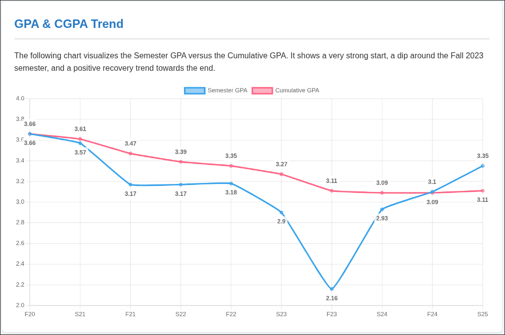

# My College Grade Analysis

[](https://YOUR_USERNAME.github.io/my-college-grade-analysis/)



---

## 📖 About

An interactive web portfolio visualizing my academic journey through college. It features dynamic charts for GPA trends and grade distribution, built with HTML, CSS, and Chart.js to demonstrate my skills in data visualization and front-end development.

---

## 🛠️ Tech Stack

[](https://developer.mozilla.org/en-US/docs/Web/Guide/HTML/HTML5)
[](https://developer.mozilla.org/en-US/docs/Web/CSS)
[](https://developer.mozilla.org/en-US/docs/Web/JavaScript)
[](https://www.chartjs.org/)

---

## 🚀 Live Demo

[**View the live project here**](https://YOUR_USERNAME.github.io/my-college-grade-analysis/)

---

## 🔧 Running Locally

1.  **Clone the repository:**
    ```bash
    git clone https://github.com/YOUR_USERNAME/my-college-grade-analysis.git
    ```

2.  **Navigate to the project directory:**
    ```bash
    cd my-college-grade-analysis
    ```

3.  **Open `index.html` in your web browser.**

---

## 👤 Author

**Abdallah ElSayed Ahmed**

-   [LinkedIn](https://www.linkedin.com/in/abdullah-elsayed-350a48217/)
-   [Email](mailto:abdallah.elsaid25@gmail.com)
